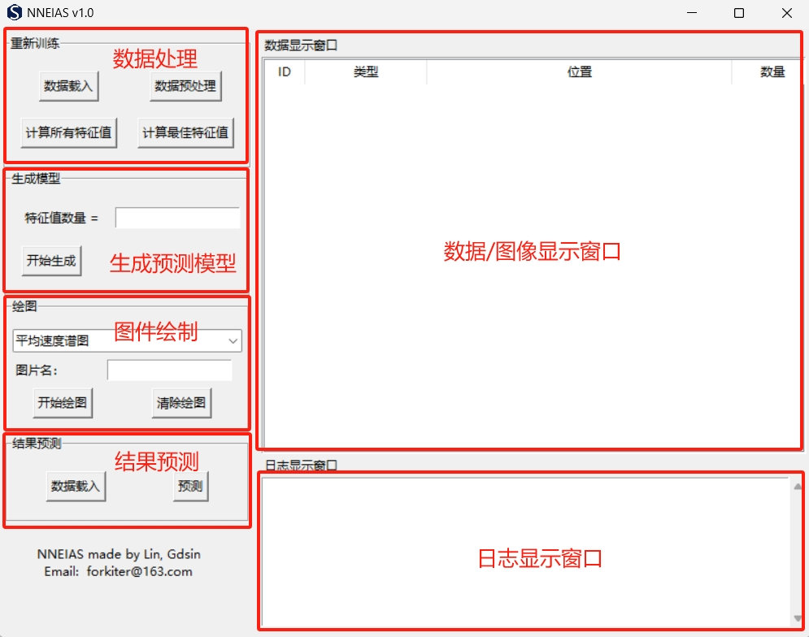

# 基于支持向量机的非天然地震识别

# Support Vector Machine for Non-natural Earthquake Identification Algorithm Software

***

## 简介

**基于支持向量机的非天然地震识别算法软件**（SVM4NneiAS）是一套用于识别天然地震，以及爆破、塌陷、矿震、水库诱发地震等非天然地震的软件。它主要基于机器学习中的支持向量机的算法，利用地震波形提取出的特征值，实现地震事件的分类。其主要作用是协助地震数据处理人员完成地震事件类型的快速判断，为地震速报和科研相关人员提供科学的现实依据。

该软件包含的功能如下：

- 针对特定研究区域地震特征值提取及重新训练；
- 区域研究预测模型的生成；
- 地震类型的预测；
- 相关的图件绘制。

##### Developer: Lin Qingxi (Email: forkiter@163.com)

***

## 安装

SVM4NneiAS 支持多种操作平台，包括macOS，Linux 和Windows 操作系统。运行该程序需要安装Python 3.x（3.8 已测试可以完美运行，其它版本可自行测试）。通过GitHub下载源程序：

```
git clone git://github.com/forkiter/SVM4NneiAS
```

1. ##### 建议先安装虚拟环境。

```
conda create -n SVM4NneiAS python=3.8
conda activate SVM4NneiAS
```

2. ##### 安装运行该程序所需的模块。

```python
pip install obspy
pip install scikit-learn
```

##### 	或者

```python
pip install -r requirements.txt
```

3. ##### 在主程序目录运行run_gui.py。

```python
python run_gui.py
```

若弹出程序主界面，则表示安装成功；否则，请根据Trackback提示进行其它模块安装，或直接联系作者。

***

## 使用

SC4FMS有独立的图形用户界面（GUI），可方便用户交互操作；也可以使用python语言进行批处理，最大限度保证用户方便快捷使用。



GUI窗口功能区见图所示。或使用python命令进行相关操作。

#### example

```python
from core.nneias import NneIa

nne = NneIa()
nne.data2sac() 
nne.get_all_eigs()
nne.get_opt_eigs()
nne.get_svm_model()
```

具体操作请详见用户手册（/docs/UserGuide.pdf）

***

## 说明

本软件完全开源，欢迎相关开发经验者和作者继续合作开发完善。

如使用过程中出现bug，或其它问题，可以随时邮件联系作者。Email: forkiter@163.com

